# Storeforge Architecture & Code Flow

This is the authoritative source for the diagrams below. See `CLAUDE.md`
for the rule that keeps it in sync with the code, and for the published
Artifact URL if one exists.

## 1. High-level system

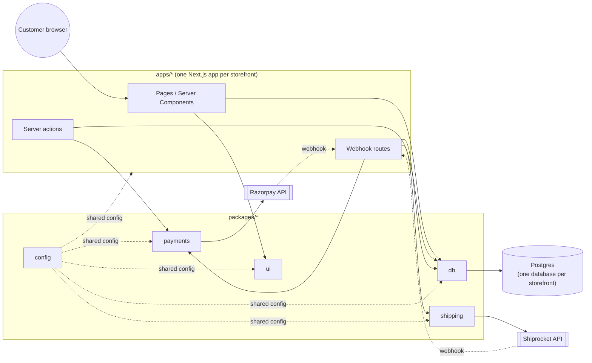

A mobile client (`apps/mobile-template`, forked as `apps/beautifulmess-mobile`
for the first real client) talks to the same storefront app over a JSON
API instead of rendering its pages -- see diagram 10 for that
architecture in detail.

## 2. Package dependency graph

Who imports whom (build-time, not runtime). `packages/config` sits under
everything; `packages/db` is the only shared package `payments`/`shipping`
depend on.

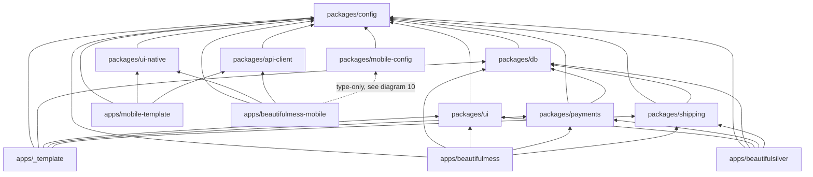

`packages/api-client` has no build-time dependency on `apps/beautifulmess`
(or any storefront app) -- it talks to `app/api/mobile/**` purely over
HTTP, at a base URL supplied at runtime. See diagram 10.

## 3. Purchase flow (generic, any storefront app)

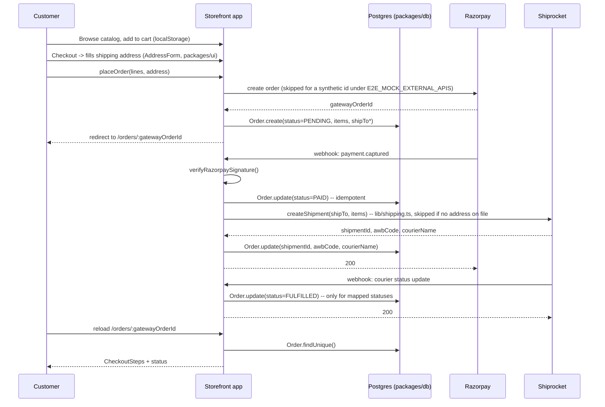

**Two webhook compositions exist**, both documented in code where they
differ:

- `packages/payments`' own default `POST` handler *creates* the order row
  lazily, on the webhook, and relies on `Order.gatewayOrderId`'s unique
  constraint (P2002) for idempotency. This is what a storefront gets by
  re-exporting `POST` from `@storeforge/payments` directly.
- `apps/_template`, `apps/beautifulmess`, and `apps/beautifulsilver` instead
  pre-create the order at `PENDING` when checkout starts, so their own
  webhook routes compose `verifyRazorpaySignature` with an
  `updateMany({ where: { status: "PENDING" } })` instead -- idempotent
  because a redelivery finds no matching row to update. See
  `app/api/webhooks/razorpay/route.ts` in any of the three apps.

`packages/shipping`'s handler always updates (never creates), so it
composes with either model unchanged.

## 4. `packages/db` schema

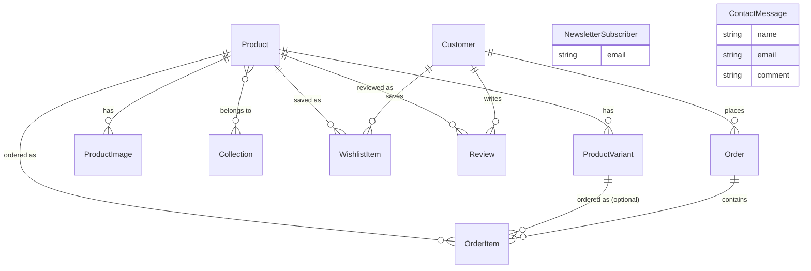

`NewsletterSubscriber` and `ContactMessage` are intentionally standalone
(no relation to `Customer`) -- the footer newsletter form and the Help >
Contact page's form are both anonymous, no account required. They
replace what were previously `action="mailto:..."` forms, which don't
reliably work across browsers and never stored a submission anywhere;
see `apps/beautifulmess/lib/newsletter-actions.ts` and
`contact-actions.ts`.

`Customer.passwordHash` (nullable) and `WishlistItem` support an
account/login feature -- the actual password hashing, session handling,
and account pages are app-local (an app that wants accounts builds its
own `lib/auth.ts`), only this storage shape is shared. See
`packages/db/README.md`.

`ProductVariant`, `ProductImage`, and `Collection` were added onboarding
the first real client (Beautiful Mess) -- all optional/empty-by-default,
so a single-variant, single-image product still behaves like the original
shape. See `packages/db/README.md`.

`Review` (one per customer per product, requires an account) supports a
product-detail "Customer Reviews" section -- starts empty for a migrated
catalog rather than backfilled with invented reviews. `ProductVariant`
also gained a nullable `stockQty` (null = untracked/unlimited, 0 = sold
out) so a storefront can optionally import real inventory data. See
`packages/db/README.md`.

`Customer.expoPushToken` (nullable) was added for the mobile app's push
notifications (diagram 11) -- one token per customer, set by a mobile app
via `POST /api/mobile/push-token` after login. Not a separate table: this
reference app models one active device per customer, not a device list.

`Order` gained `shipTo*` fields (name, email, phone, addressLine1(+2),
city, state, pincode) and `shipmentId`/`awbCode`/`courierName` -- all
nullable -- when the Shiprocket integration was completed (diagram 3):
Shiprocket's `createShipment` API needs a finished destination address
per order and doesn't collect one itself, so each storefront's checkout
now collects it (`packages/ui`'s `AddressForm`, backed by Google Places
Autocomplete) and stores it directly on `Order` rather than a separate
`Address` model, since nothing reuses a saved address across orders yet.
See `packages/shipping/README.md`.

## 5. `packages/ui` theming flow

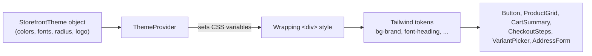

No component reads a color/font literal directly -- swapping the theme
object is the entire branding surface. Enforced by
`packages/ui/src/theme/theme-provider.test.tsx`, which renders `Button`
under two unrelated themes and asserts identical output.

## 6. `packages/payments` webhook idempotency (default handler)

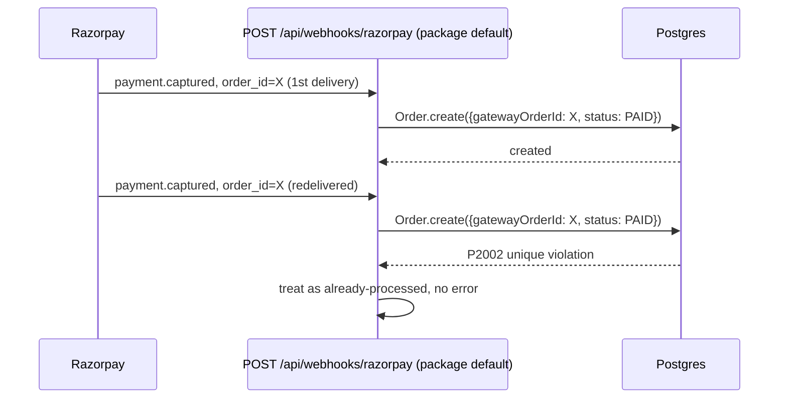

## 7. `packages/shipping` status mapping

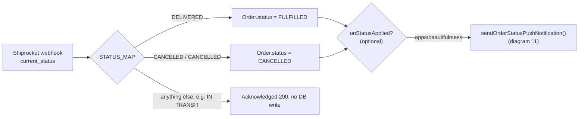

`applyCourierStatus`/`POST` take an optional `onStatusApplied` callback,
fired only when a status actually changed -- `packages/shipping` itself
knows nothing about push notifications; `apps/beautifulmess`'s own
`app/api/webhooks/shiprocket/route.ts` supplies the callback. Any other
storefront app can ignore the parameter with no behavior change.

## 8. `apps/beautifulmess` catalog import pipeline

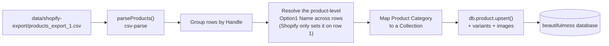

## 9. CI pipeline

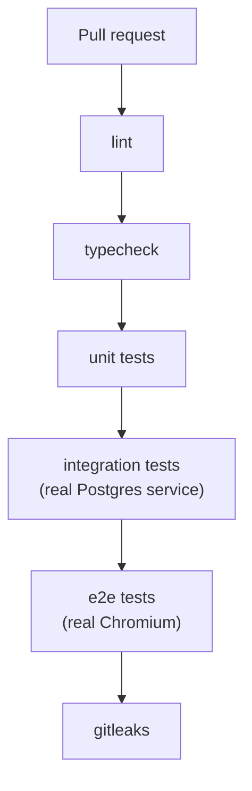

Scoped to the PR's changed packages via
`--filter=...[origin/<base-branch>]` on `pull_request`; runs unfiltered on
a direct push to `main`. See `.github/workflows/ci.yml`.

## 10. Mobile app architecture

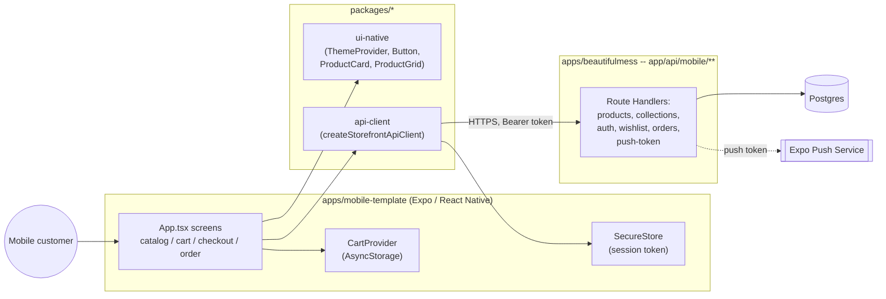

`app/api/mobile/**` reuses the exact same pure business logic the web
Server Components/Actions call (`lib/catalog.ts`, `lib/checkout.ts`,
`lib/wishlist.ts`, ...) -- each mobile route is a thin JSON wrapper, never
a second implementation. Auth travels as a `Authorization: Bearer` header
instead of a cookie, verified by the same `verifySessionToken()` the web
cookie path uses (`lib/auth.ts`'s `getCustomerIdFromAuthHeader`).

## 11. Mobile checkout + push notification flow

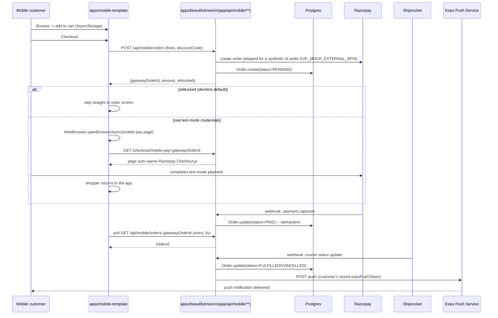

The Razorpay/Shiprocket webhooks are the same handlers the web purchase
flow (diagram 3) uses, completely unaware mobile exists -- mobile just
polls the same `Order` row the web `/orders/:gatewayOrderId` page reads.
Push delivery only happens if the customer is logged in and granted
notification permission (`POST /api/mobile/push-token`); it's silently
skipped otherwise (diagram 7).

## 12. Per-client mobile config (`packages/mobile-config`)

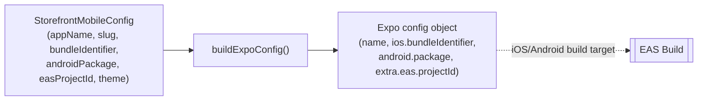

The mobile analogue of each web app's `app/layout.tsx` theme object --
`apps/beautifulmess-mobile/app.config.ts` supplies Beautiful Mess's real
bundle ID, Android package, and theme colors (matching
`apps/beautifulmess`'s own layout). `buildExpoConfig()` implements this
merge and has its own unit tests, but Expo's config loader executes
`app.config.ts` directly under Node's CommonJS `require()` (outside
Metro), and `packages/mobile-config` ships ESM source with no build
step -- a runtime `import` of it from `app.config.ts` fails, so today
`app.config.ts` only takes a *type-only* import from the package and
inlines the equivalent object literal itself. `buildExpoConfig()` stays
the source of truth for what that merge should produce; switching
`app.config.ts` back to calling it directly is a one-line change once the
package gains a real CJS build output.
