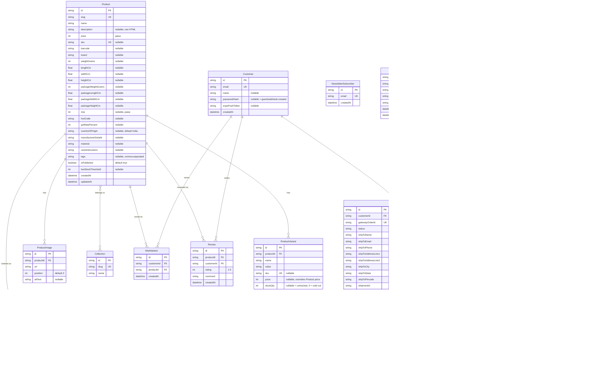

# Database schema (Neon Postgres)

The full entity-relationship diagram for `packages/db/prisma/schema.prisma`
-- every table and column that actually exists in each storefront's real
Neon database (every storefront copies this schema into its own isolated
instance; see `packages/db/README.md` and the Isolation section of
`CLAUDE.md`). This is the single source of truth for schema shape --
`docs/architecture.md`'s diagram 4 keeps a short relations-only summary
plus the commentary on *why* each addition happened, and links here for
the full picture.

**Keep this file current**: regenerate the diagram below whenever
`packages/db/prisma/schema.prisma` changes (new model, new field, new
relation, new enum). See CLAUDE.md's "Architecture diagrams" section.

## Notes

- **`Customer` and `AdminUser` are deliberately unconnected** -- no
  foreign key between them. `AdminUser` must never be reachable through a
  shopper-facing query. `apps/beautifulmess`'s "Admin" site-header tab
  bridges the two at the *session* layer only (matching email + an
  allowlist check at request time, not a database relation) -- see
  `lib/admin/auth.ts#establishAdminSessionForCustomer` and diagram 4's
  commentary in `docs/architecture.md`.
- **`NewsletterSubscriber` and `ContactMessage` are standalone** -- both
  forms are anonymous, no account required.
- Every storefront's Neon database has its own copy of this exact schema
  (isolation model, see `CLAUDE.md`) -- this diagram is the shape shared
  by all of them, not a single shared database.
